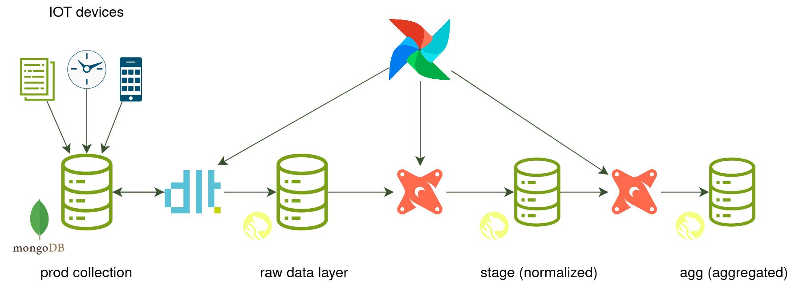

# IOT Smartwatch ETL (Health Insights)

The idea for this project is to create a system that can provide analytics on the fly and introduce a customizable tool for developers, data scientists, and analysts to set up a data processing stack with architecture that is described below so that they can make decisions faster and minimize time to delivery for their research.

This project implements a scalable data pipeline for IOT smartwatch data using modern stack: [Airflow](https://airflow.apache.org//), [dbt](https://docs.getdbt.com/docs/introduction) and [dlt](https://dlthub.com/) for data orchestration; [MongoDB](https://www.mongodb.com) source database, and Postgres as a DWH (more specifically [TimescaleDB](https://www.timescale.com/)) for long-term persistence. IOT smartwatch data generated for the project corresponds to [Fitbit](https://www.fitbit.com/global/us/home) format.

## Solution Architecture



In order to perform scheduling data processing I chose **Airflow** as a default data engineering tool to orchestrate ETL processes. As it can be easily deployed on **K8s** to facilitate scaling and offers enough flexibility to design ETL of any complexity.

For data transformations I decided to use **dlt** - a modern tool for non-structured data that offers an abstraction to generate schema for source/destination data and automates ELT tasks to map collections from the source to a target database without maintaining database interfaces (i.e. JDBC, airflow operators) through code-generation only. After the data is uploaded to target DWH in the form of raw data sources we can process it using **dbt**; Modern tool that executes SQL code across a wide variety of databases, allows to generate code using templates, and offers other utility tools to define SQL tables, schemas and configure their materialisation.In other terms, write less code, reuse common expressions, and have a database-agnostic connector.

The database layer has raw source **MongoDB** - production storage that will be used to store IOT data from devices that are streamed as raw documents. While **Timescaledb** is used by production services (e.g. ML feature store) as well as by users to extract data from analytical OLTP DWH. The long-term persistence **Timescaledb** layer is shared across all transformations and is useful to access once raw data is needed to train ML models, as well as to persist data history to recover information in the case of data corruption.

## Pipeline & Storage Layers

Processing consists of three steps: extraction, load, and transformation. Extraction refers to gathering data from external sources (in our case **MongoDB** as it can be easily scaled and offers KV document storage that has high throughput), production devices are supposed to stream data and ingest it into this source initially. As mentioned earlier, in order to speed up the development, reduce code I chose **dlt** to model both extract and load steps since it offers code generation for schema, incremental data retrieval and data ingestion to RDBMS (**Timescaledb** is perfect for our use case since we need to model relationships between entities and offers incredible query, IO performance). Finally, after the sources have been ingested to our **Timescaledb** DWH - we can normalise, transform and aggregate data using **dbt** to execute SQL models that we design in advance.

Layer `raw` refers to the transformation data processing that should clean, type cast data acquired from sources as is. It is a critical step to obtain control over new data, grasp inner relations, and load it properly as later stages would benefit greatly since users will focus on developing analytical insights rather than constructing cleaning routines for each new provider.

Next, `stage` layer refers to the intermediate processing that will have already cleansed data and offer a layer for combining entities into more complex structures such as monthly, and daily event aggregates; This layer should be accessible for analysts to test hypotheses and do due dilliigent research into properly organizing `dimensions` and `fact` tables to reduce duplication and save processing costs.

Finally, `agg` level refers to the aggregate layer, event tables, and fact tables that can be used in production for quick research and by other services (i.e. BI tools, ML models, and production applications).

## Installation & Running

The usual:

```bash
docker-compose up
```

## Data Processing Strategy

In my opinion data processing strategy should come from business needs and offer a "good-enough" solution that can sustain current business requirements by delivering more value than creating trouble. By trouble, I mean developer experience, unexpected bottlenecks, and runtime errors for service-critical APIs. Even though, we cannot predict absolutely everything - we should focus on common pitfalls that arise during the design of ETL pipelines, as well as to take time to evaluate potential business-related risks. Focus on tools that offer long-term scaling, transparent software that can be quickly configured, processing that can scale in the future when data grows bigger, and deliver sustainable, predictable SLAs.

#### IOT Data format

**Fitbit** files represent an aggregated view over health events collected by device that occurred in a given timeframe; it includes, but is not limited to: `sleeps` (duration, levels for the health inquiry), `steps` (step count, sometimes gyroscope coordinates), `heart_rates` (beats per minute, confidence), `users` (device holder description details). [Script](./shared/mongodb/initdb.d/generator.py) for generating data, and [folder](./shared/mongodb/initdb.d/data/) with samples that were used to perform ETL in this project was taken from a public dataset [PMData](https://datasets.simula.no/pmdata/) that restrospectively analysed health metrics for 16 participants using IOT data.

#### Incremental run

Data processing optimization was to filter data by specific dates because even after splitting IOT files into tables timestamp data across multiple devised per user grows quickly and once we have received too much data our processing unit will not be able to handle it in memory and terminate. To address this issue we should be sure that a specified period of time will always be good to go both for the database and our SQL queries. To achieve that we have to identify a desired level of granularity.

Currently system supports the following process: if the run is initial - it will retrieve all historical data from the database and launch process/aggregation tasks in a single run. The following runs will ALWAYS use a filter to retrieve records that exceed the execution date from the previous run and process them. Project offers enough tools to design a historical backfill task that would split the upload into days/months/years, but initial idea was to create an orchestrator that would be deployed to support a database from the start and collect data in sequence.

## Orchestration Setup


Commonly data is distributed by means of using **MongoDB** sink to collect `bucketed` metrics (i.e. every 15 min) across mobile phones, smart watches using streaming solutions. The start of the pipeline begins once _IOT data services_ have uploaded files to their sink. We will have a sensor that will check for new arrivals with **MongoDB** trigger or periodically launch our `raw` extraction job to extract and load new files to DWH.

Current orchestration setup and monitoring tools are essential for process recovery, transparency, and ease of development - **Airflow** would be used in order to visually decompose processes and dig down to specific parts of the pipeline, as well as recover failures. It offers multiple tools to control for orchestration setup, however, I mostly focused on batch execution using `daily/weekly/..` schedules to automate the `raw` upload process as well as trigger normalisation `stage` jobs, which essentially materializes a table once its dependencies are met. Code can be found in [dags](./dags/) folder. Bird's eye view over the process can be described as follows:

- wait 15 minutes and trigger a sync job that would extract `raw` documents from all **MongoDB** collections and load them to DWH **Timescaledb**
- sensor checks previous job completion and launches `stage` job that normalises data
- schedule `daily/weekly/monthly` jobs to aggregate data in `agg` schema for health metrics that need bigger scale
