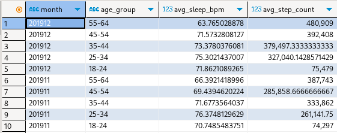
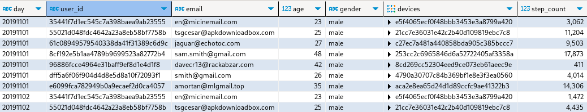

# IOT Smartwatch ETL (Health Insights)

The idea for this project is to create a system that can provide analytics on the fly and introduce a customizable tool for developers, data scientists, and analysts to set up a data processing stack with architecture that is described below so that they can make decisions faster and minimize time to delivery for their research. This project implements a scalable data pipeline for IOT smartwatch data using modern stack: [Airflow](https://airflow.apache.org//), [dbt](https://docs.getdbt.com/docs/introduction) and [dlt](https://dlthub.com/) for data orchestration; [MongoDB](https://www.mongodb.com) source database, and Postgres as a DWH (more specifically [TimescaleDB](https://www.timescale.com/)) for long-term persistence. IoT smartwatch data generated for the project corresponds to [Fitbit](https://www.fitbit.com/global/us/home) format, more details about the format [below](#iot-fitbit-data-format).

## Solution Architecture


To schedule data processing I chose **Airflow** as a default data engineering tool to orchestrate ETL processes. It can be easily deployed on **K8s** to facilitate scaling and offers enough flexibility to design ETL of any complexity.

For data transformations, I decided to use **dlt** - a modern tool for non-structured data that offers an abstraction to generate schema for source/destination data and automates ELT tasks to map collections from the source to a target database without maintaining database interfaces (i.e. JDBC, airflow operators) through code-generation only. After the data is uploaded to target DWH in the form of raw data sources we can process it using **dbt**; a modern tool that executes SQL code across a wide variety of databases allows to generate code using templates, and offers other utility tools to define SQL tables, schemas and configure their materialization. In other terms, write less code, reuse common expressions, and have a database-agnostic connector.

The database layer has raw source **MongoDB** - production storage that will be used to store IOT data from devices that are streamed as raw documents. While **Timescaledb** is used by production services (e.g. ML feature store) as well as by users to extract data from analytical OLTP DWH. The long-term persistence **Timescaledb** layer is shared across all transformations and is useful to access once raw data is needed to train ML models, as well as to persist data history to recover information in the case of data corruption.

## Pipeline & Storage Layers

Processing consists of three steps: extraction, load, and transformation. Extraction refers to gathering data from external sources (in our case **MongoDB** as it can be easily scaled and offers KV document storage that has high throughput), production devices are supposed to stream data and ingest it into this source initially. As mentioned earlier, to speed up the development, and reduce code I chose **dlt** to model both extract and load steps since it offers code generation for schema, incremental data retrieval, and data ingestion to RDBMS (**Timescaledb** is perfect for our use case since we need to model relationships between entities and offers incredible query, IO performance). Finally, after the sources have been ingested into our **Timescaledb** DWH - we can normalize, transform, and aggregate data using **dbt** to execute SQL models that we design in advance.

Layer `raw` refers to the transformation data processing that should clean, and type cast data acquired from sources as is. It is a critical step to obtain control over new data, grasp inner relations, and load it properly as later stages would benefit greatly since users will focus on developing analytical insights rather than constructing cleaning routines for each new provider.

Next, `stage` layer refers to the intermediate processing that will have already cleansed data and offer a layer for combining entities into more complex structures such as monthly, and daily event aggregates; This layer should be accessible for analysts to test hypotheses and do due diligent research into properly organizing `dimensions` and `fact` tables to reduce duplication and save processing costs.

Finally, `agg` level refers to the aggregate layer, event tables, and fact tables that can be used in production for quick research and by other services (i.e. BI tools, ML models, and production applications).

## Installation & Running

The usual:

```bash
docker-compose up
```

When services are launched:

- navigate to [Airflow UI](https://localhost:8080)
- login with default credentials (`airflow` for both)
- explore each DAG's docs in UI

To run main ETL job:

- turn on ETL dependency job dags
  - `iot_raw_extract`
  - `iot_stage_transform`
- turn on master dag to orchestrate pipeline
  - `iot_master_dag`
- explore results in `raw`/`stage` schemas in TimescaleDB using **DBeaver**

To run aggregate jobs (after master dag has completed):

- turn on any of the desired:
  - `iot_agg_transform_daily`
  - `iot_agg_transform_weekly`
  - `iot_agg_transform_monthly`
- explore results in `agg` schema in TimescaleDB using **DBeaver**

## Data Analytics Query Examples

DWH offers ELT to prepare daily/monthly/weekly aggregates and factual dimensions (users/devices) to streamline analytics and quickly build processing software using similar architecture. Some query examples showcase how to build health insights starting with `stage` and `agg` layers.

Aggregated data across users to find average health metrics for different age groups ([monthly query file](./dags/dbt_project/models/examples/monthly_health_metrics_per_age_grp.sql)), where:

- _`avg_sleep_bpm`_ represents heart beats per minute during sleep
- _`age_group`_ an age bucket to compare monthly health metrics
- _`avg_step_count`_ average total monthly steps achieved by the group



User's daily steps summary for the past month ([query](./dags/dbt_project/models/examples/daily_user_steps_for_last_month.sql) with generated date filter rendered before execution)

- _`devices`_ showcases all smart watch/phone ids associated with a user
- _`step_count`_ total steps each day to pre-compute data for quicker analysis



## Data Processing Strategy

In my opinion data processing strategy should come from business needs and offer a "good-enough" solution that can sustain current business requirements by delivering more value than creating trouble. By trouble, I mean developer experience, unexpected bottlenecks, and runtime errors for service-critical APIs. Even though, we cannot predict absolutely everything - we should focus on common pitfalls that arise during the design of ETL pipelines, as well as to take time to evaluate potential business-related risks. Focus on tools that offer long-term scaling, transparent software that can be quickly configured, processing that can scale in the future when data grows bigger, and deliver sustainable, predictable SLAs.

#### IOT Fitbit data format

**Fitbit** files represent an aggregated view over health events collected by device that occurred in a given timeframe; it includes, but is not limited to: `sleeps` (duration, levels for the health inquiry), `steps` (step count, sometimes gyroscope coordinates), `heart_rates` (beats per minute, confidence), `users` (device holder description details). [Script](./shared/mongodb/initdb.d/generator.py) for generating data, and [folder](./shared/mongodb/initdb.d/data/) with samples that were used to perform ETL in this project was taken from a public dataset [PMData](https://datasets.simula.no/pmdata/) that retrospectively analyzed health metrics for 16 participants using IOT data. Source data used in this project can be divided into timeseries tables (`heart_rates`, `sleeps`, `steps`) and fact table that show IoT user information (`users`).

Table `users` contains info relevant to device holders to be used for marketing, real-time alerts and demographic research, source file for **MongoDB** is declared as [JSON](./shared/mongodb/initdb.d/data/users.json). The table has the following fields:

| age | height | gender | user_id  | created_at | devices      | email               | dob       |
| --- | ------ | ------ | -------- | ---------- | ------------ | ------------------- | --------- |
| 48  | 195    | male   | 02933... | 1572566400 | [cc05138...] | sam.smith@gmail.com | 209865600 |

Source file `heart_rates.json` contains information relevant to heart metrics that is aggregated each 4 hours. It is common to bucket IoT data to time periods of specified length (15m, 1h or 4h) to group batches for a more performant processing/insertion downstream (more info on why it works can be found in **MongoDB** [article](https://www.mongodb.com/docs/manual/tutorial/model-iot-data/)) as follows (unix timestamp is replaced by readable date string):
| device_id | created_at | ended_at | metrics |
| --- | --- | --- | --- |
| cc05138... | 2020/02/01 02:00 | 2020/02/01 06:00 | [{"ts":2020/02/01 02:00:18, "bpm":53, "confidence":3},...] |
| cc05138... | 2020/02/01 06:00 | 2020/02/01 10:00 | [{"ts":2020/02/01 06:00:12, "bpm":64, "confidence":3},...] |

`Sleeps` metrics in corresponding [json](./shared/mongodb/initdb.d/data/sleeps.json) showscase when IoT device detected sleeping cycle and total sleep duration. It is used later on to detect average bpm during sleep to compare across age groups. Similarly data is grouped by time buckets, where duration is expressed in milliseconds (`22560000/3600000=~6.27h`), while the record itself is recorded after the whole sleeping cycle has elapsed (we know start/end timestamp of the sleep) and `created_at`/`ended_at` are offsets to capture `end_ts` that refers to the end of the sleeping cycle. It has the following outlay:

| device_id  | created_at          | ended_at            | metrics                                                                                  |
| ---------- | ------------------- | ------------------- | ---------------------------------------------------------------------------------------- |
| cc05138... | 2020/02/01 08:15:00 | 2020/02/01 08:30:00 | [{"start_ts": 2020/02/01 02:02:30, "end_ts": 2020/02/01 08:19:00, "duration": 22560000}] |

Finally, `steps` raw input files record steps that occurred for a particular timestamp that we can aggregate later to capture daily/monthly activity for the given user's device. The table is also aggregated during specific period of 15 minutes and has the following structure:

| device_id  | created_at          | ended_at            | metrics                                                                                                                     |
| ---------- | ------------------- | ------------------- | --------------------------------------------------------------------------------------------------------------------------- |
| cc05138... | 2020/03/08 18:00:00 | 2020/03/08 18:15:00 | [{"ts": 2020/03/08 18:01:00, "steps": 0},{"ts": 2020/03/08 18:02:00, "steps": 16},{"ts": 2020/03/08 18:03:00, "steps": 26}] |

#### Incremental run

Data processing optimization was to filter data by specific dates because even after splitting IOT files into tables timestamp data across multiple devised per user grows quickly and once we have received too much data our processing unit will not be able to handle it in memory and terminate. To address this issue we should be sure that a specified period will always be good to go both for the database and our SQL queries. To achieve that we have to identify a desired level of granularity.

Currently system supports the following process: if the run is initial - it will retrieve all historical data from the database and launch process/aggregation tasks in a single run. The following runs will ALWAYS use a filter to retrieve records that exceed the execution date from the previous run and process them by rendering a **WHERE** clause filter for each SQL model that would lookup latest existing date on table and run filter i.e. `WHERE day = '20200101'`. The project offers enough tools to design a historical backfill task that would split the upload into days/months/years, but the initial idea was to create an orchestrator that would be deployed to support a database from the start and collect data in sequence.

## Orchestration Setup


Commonly data is distributed through using **MongoDB** sink to collect `bucketed` metrics (i.e. every 15 min) across mobile phones, and smart watches using streaming solutions. The start of pipeline begins once _IOT data services_ have uploaded files to their sink. We will have a sensor that will check for new arrivals with **MongoDB** trigger or periodically launch our `raw` extraction job to extract and load new files to DWH.

Current orchestration setup and monitoring tools are essential for process recovery, transparency, and ease of development - **Airflow** would be used to visually decompose processes and dig down specific parts of the pipeline, as well as recover failures. It offers multiple tools to control for orchestration setup, however, I mostly focused on batch execution using `daily/weekly/..` schedules to automate the `raw` upload process as well as trigger normalization `stage` jobs, which essentially materializes a table once its dependencies are met. The code can be found in [dags](./dags/) folder. Bird's eye view over the process can be described as follows:

- wait 15 minutes and trigger a sync job that would extract `raw` documents from all **MongoDB** collections and load them to DWH **Timescaledb**
- sensor checks previous job completion and launches `stage` job that normalizes data
- schedule `daily/weekly/monthly` jobs to aggregate data in `agg` schema for health metrics that need bigger scale

### Transformation layer

Currently transformation layer is focused around **dbt** tool that translates SQL code to supported DWH adapter (in our case **Timescaledb**), therefore, upon ingesting `raw` data into the database - the normalisation, aggregation, and following transformations are delivered by explicit queries to the DWH. The reason behind choosing this approach was mainly due to overhead in development/execution time associated with **Flink**, and **Spark** solutions, sometimes spinning up a separate **K8s** cluster is excessive; Our project focused on the POC solution that glances over possible architectural approach rather than big data oriented custom solution (it is quite easy to convert existing **dbt** pipelines into **Spark** jobs), but for the most part data ingested into the DWH should not exceed hundred-gigabyte threshold because current pipelines are oriented to schedule bucket transformation every 30 minutes (short timespan) and consequently have a fairly low impact on DWH performance by filtering data to a single day ingestion limit. Moreover, it is convenient to start with a more simple analytical application and add processing complexity once it is required by business needs rather than doing premature optimization that would complicate both developer's experience and project management SLAs.

### Scalability

IoT data processing complexity grows quite quickly, therefore, one of the considerations was to use tools that streamline scaling IO/ELT jobs. The pipeline can be divided into two subsections, which should be scaled independently due to the nature of isolated infrastructure.

#### Extract

The extraction step occurs whenever we want to retrieve `raw` sources from **MongoDB** that stores IOT device level data and push normalized data to `dwh.raw` schema to our **Timescaledb** DWH. By default, we use **dlt** tool to automate each part of the process for every existing document collection, since we also need to scale the process at some point - we have to consider what **dlt** offers out of the box. Depending on the nature of the data we could either work with a multitude of small documents or a big unionized collection of a single document, in advance it is impossible to know such details, but [documentation](https://dlthub.com/docs/reference/performance) offers enough information on how to adjust resources, so that our **Airflow** worker (**Celery**) would be able to scale the ELT across cores/threads effectively. The current configuration declared in `.env` uses:

- 5 cores to extract documents from **MongoDB** collections

```
SOURCES__MONGODB__EXTRACT__WORKERS=5
```

- 20 threads to ingest `raw` data to **Timescaledb** DWH

```bash
DESTINATION__POSTGRES__LOAD__WORKERS=20
```

While the extraction job itself is defined in the following **Airflow** [dag](./dags/iot_mongo_extract_to_dwh.py).

#### Transform

Refers to all steps in the pipeline after initial `raw` sources were pushed to DWH `dwh.raw` schema, and are now available for general queries using JDBC driver. Tool **dbt** can be seen as a database-agnostic interface that would execute SQL query on our DWH, as such it does not scale on its own, it just translates existing code from templates in [models](./dags/dbt_project/models/) to runtime code for the database.

Therefore, the approach to scale the transform layer would be to figure out sufficient resources based on the expected data growth/analytical query load and adjust it either in an on-premise or cloud solution, so that it could withstand both throughput daily IO from ETL pipeline, and new development resources required by the analytical team. Then **dbt** would continue to render and execute needed SQL models to keep the DWH updated for production use.

#### Approach clarification

Both options are not ideal but are rather convenient starting places where the information is not clear since SQL code could be migrated to **ClickHouse**, and **SparkSQL** without too much development overhead, but the main advantage is that the pipeline can be treated as a black box and could scale on its own by providing more resources and tweaking environment variables to scale the processing automatically without memorizing partitioning/software architecture. In short infrastructure capacity is the means of scaling ELT/transformation stages which decouples and isolates the complexity associated with parallelization for POC jobs until we are required to modify the system due to new information related to domain-specific data/project requirements.

### Streaming Architecture Considerations

Due to time constraints I had to focus on the DWH architecture and pipeplines for this project, however, the IOT device data delivery is an interesting project too. Recently I have completed a Rust-based streaming [application](https://github.com/lithiferous/kstream-agg-rs) that would compute agreggation on the fly using **Kafka**, to use it for this project it would require some adjustments to stream data to our **MongoDB**, however, or showcases rich ecosystem including schema management, intermediate sink, producer/consumer jobs. As an option we could also consider **Spark-streaming**, **NiFi**, **Flink** or **Memphis.dev** to accomplish continuously updated source database sink which offer flexible APIs to perform window-based transformations and control data quality, schema changes on the go.
